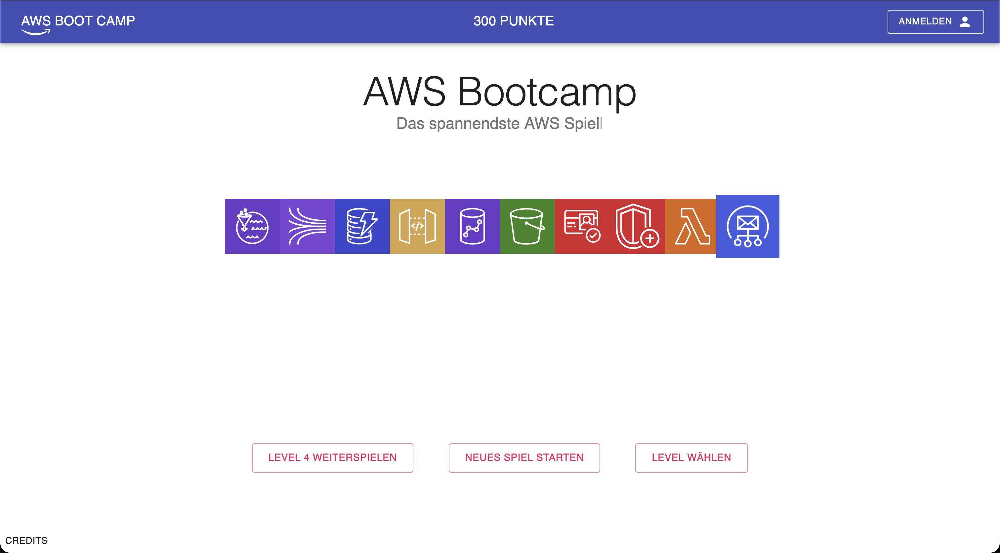
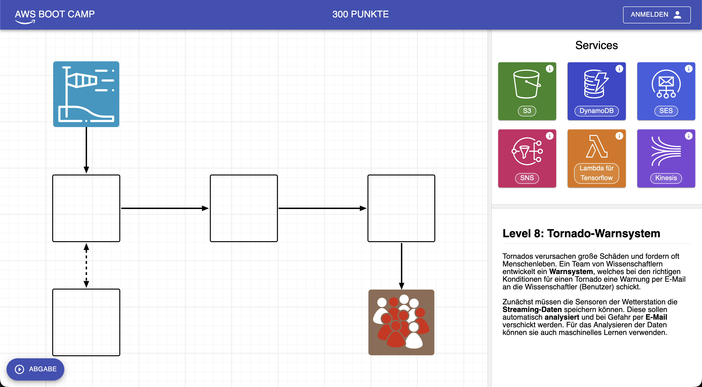

# Game

A game for teaching the basics of serverless using AWS.

## Setup

1. Install [Node.js][1]
2. `git clone git@gitlab.com:progprak-sose-19/game.git`
3. `cd game`
4. `npm install`

## Development

1. `npm start`
2. open http://localhost:8080/
3. Changes saved will be automatically reloaded in the browser

[1]: https://nodejs.org/

## Screenshots

### Start Screen

### Example Level

